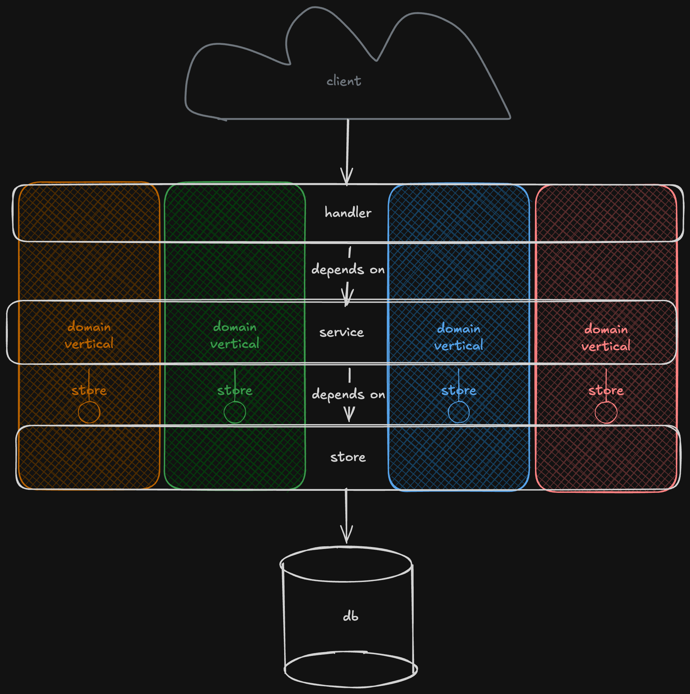

# Architecture

This project's architecture is a pragmatic, simplified take on ports-and-adapters
(hexagonal) architecture, combined with vertical slices: each domain concern
(`user`, `order`, ...) lives in its own package, containing everything needed
to serve that domain end to end.

## Layers

Each domain package has three layers, always in the same three files:

### Handler

**i.e. `http_handler.go`**
Translates wire format to domain and back.
Parses and validates incoming requests, maps domain values to HTTP status
codes, marshals responses.
Knows nothing about how a `User` is fetched or what business rules apply,
only how to move it in and out over HTTP.

Handler translates wire types into domain values by calling domain constructors
(NewEmail, ...); any error from that step is a 400. Domain types own their
format rules. Service accepts only domain types and enforces rules that need
state or I/O (uniqueness, permissions).

### Service

**`service.go`**
Pure domain/business logic. No I/O of its own; it only
orchestrates calls to an interface it owns.
This is where the important logic lives, and it's kept supremely testable:
a hand-written fake satisfying its interface is enough, no mocking framework,
no database.

### Store

**i.e. `sql_store.go` or `mongo_store.go`**
Translates domain language to infrastructure language
and talks to the storage provider directly (e.g. `SQLStore` runs SQL against
Postgres).
This is also where infra-specific errors are translated into the
package's domain-level sentinel errors (see below).

### Dependency direction

Dependencies point inward on the store side: `Service` depends on a `storer`
interface it defines for what it needs from the world. Concrete `Store`
types (`SQLStore`, `MongoStore`) satisfy this interface structurally;
`Service` never imports `database/sql` or knows a concrete store exists.

Handlers depend on the concrete `Service`. There is exactly one Service per
domain, so an interface at this edge would only restate its method
signatures. Handler tests build a real `Service` over a shared per-domain
`fakeStore` (`fakes_test.go`). If a handler needs to test a Service-originated
error that the fake store can't trigger, introduce a small handler-owned
interface for that handler then, not before.

> Matches YAGNI: add the abstraction when a concrete pain shows up

## Interface ownership

Interfaces are defined by the consumer, next to the type that uses them,
not bundled into a shared file by "kind." `storer` lives in `service.go`
because only `Service` depends on it. This keeps Service's tests minimal:
a fake with just the methods `storer` declares, no database.

This rule doesn't extend to every layer boundary by default — see
"Dependency direction" above for a boundary where a consumer-owned
interface was deliberately not introduced, and why.

Interfaces start collapsed to a single `storer`-style contract.
Segregating it further into single-verb interfaces (`reader`, `creator`,
...) is a deliberate later step, taken only when something actually needs
to diverge per verb; CQRS (reads/writes on different backends), a
cache-aside reader, permission boundaries. Splitting ahead of that need is
cheap but not free; do it when a second implementation shows up, not before.

> Same principle as the Handler/Service boundary above: segregate when a
> second implementation needs it, not in anticipation of one.

## Models

### Domain model

Declared in `models.go`: `User`, `ID`.
Validated, trusted, shared across all three layers.

Domain types here are intentionally data-only; business rules live in Service
methods rather than on the model itself. Revisit this if a domain's invariants
get complex enough that scattering them across Service methods becomes
error-prone.

### Wire model

Declared in `http_handler.go`: `CreateRequest`, `ReadRequest`.
Unvalidated, HTTP-shaped, exists only to get bytes off the network into
something Go can hold. Lives with the handler that constructs it, not with the
domain model — it should never leak past the handler boundary.

## Errors

Sentinel errors (`ErrNotFound`, `ErrConflict`, ...) are defined in
`errors.go`, owned by the domain package. Every adapter is responsible for
translating its own failure mode into these sentinels at the point the
original error occurs (e.g. `SQLStore.Read` turns `sql.ErrNoRows` into
`ErrNotFound`). Nothing above the store layer should ever see a driver-
specific error.

## Wiring

Each domain package is assembled in `internal/api/setup.go`:
store → service → handler, three lines. Routes are registered onto a shared
`*http.ServeMux` via a `setupXRoutes(mux, handler)` function per domain —
side-effecting registration, matching the standard library's own
`mux.Handle` idiom.

## Testing

- `Service` is tested against a fake `storer`; no database, no mocking
  framework.
- `Handler` is tested against a real `Service` built over a shared
  per-domain `fakeStore`; handler and service tests share one fake,
  so there's one thing to maintain per domain instead of two.

## Exceptions from the rules

- OpenTelemetry defaults to using global variables for tracing and metrics.

## References and inspiration

- "Accept interfaces, return structs." - Rob Pike's _Go Proverbs_
- "The bigger the interface, the weaker the abstraction." - Rob Pike's _Go Proverbs_
- Ben Johnson's [Standard package layout](https://www.gobeyond.dev/standard-package-layout/) and [Packages as layers](https://www.gobeyond.dev/packages-as-layers/)
- Mat Ryer's [How I write HTTP services in Go ...]( https://grafana.com/blog/how-i-write-http-services-in-go-after-13-years/)
